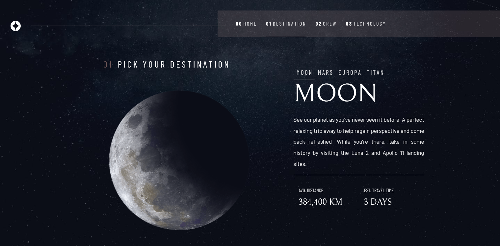
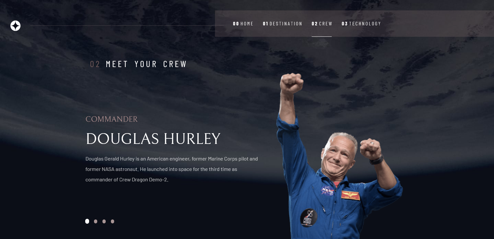
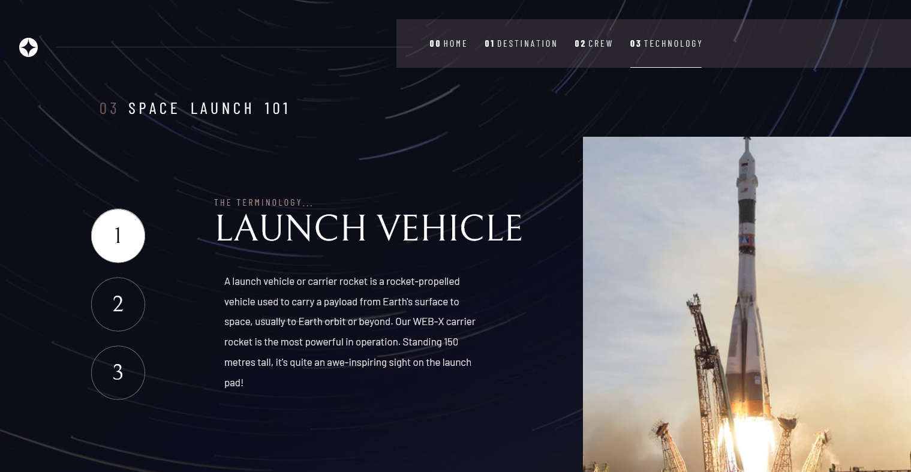

# Frontend Mentor - Space tourism website solution

This is a solution to the [Space tourism website challenge on Frontend Mentor](https://www.frontendmentor.io/challenges/space-tourism-multipage-website-gRWj1URZ3). Frontend Mentor challenges help you improve your coding skills by building realistic projects. 

## Table of contents

- [Overview](#overview)
  - [The challenge](#the-challenge)
  - [Screenshot](#screenshot)
  - [Links](#links)
- [My process](#my-process)
  - [Built with](#built-with)
  - [What I learned](#what-i-learned)
  - [Continued development](#continued-development)
- [Author](#author)

## Overview

### The challenge

Users should be able to:

- View the optimal layout for each of the website's pages depending on their device's screen size
- See hover states for all interactive elements on the page
- View each page and be able to toggle between the tabs to see new information

### Screenshot

### Links

- Solution URL: [https://github.com/i-5iici/Space-tourism](https://github.com/i-5iici/Space-tourism)
- Live Site URL: [https://i-5iici.github.io/Space-tourism/](https://i-5iici.github.io/Space-tourism/)

## My process

### Built with

- Semantic HTML5 markup
- CSS custom properties
- Flexbox
- CSS Grid
- Mobile-first workflow
- [React](https://reactjs.org/) - JS library
- [Styled Components](https://styled-components.com/) - For styles
- [Webpack](https://webpack.js.org)- Module bundler

### What I learned

I learned so much from this project, as this was one of my first project built with React! It's really a wounderful framework to code and very easy. I'm defently going to do a lot more project with React and React native.

### Continued development

I will ofcourse continue develop with React and get Pro with itm yes it's wasy but, there is a few things which was hard to understand and I had to watch some videos on YouTube and other platforms to really know what that thing is doing.

## Author

- Instagram - [5iici](https://www.instagram.com/5iici)
- Frontend Mentor - [@i-5iici](https://www.frontendmentor.io/profile/i-5iici)
- Twitter - [@5_iici](https://www.twitter.com/5_iici)
